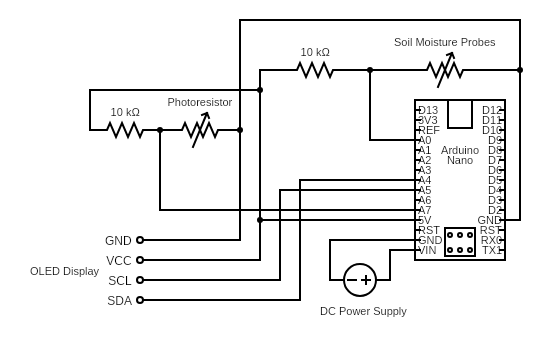

# PlantCare
DIY plant monitoring system using Arduino

My goal for this project was to create a monitoring
system that could detect when a plants soil moisture and sunlight levels and water it when necessary.

